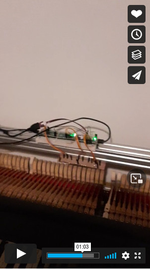

# Mybrid

### About

This repository is a collaborative space for the exploration of options to design and build the possible best
DIY electronic musical instrument, at a much less expensive price than commercial. A very important feature
enabled by the DIY approach is to be totally in charge of the instrument and be able to change things as one
prefers, a big plus for digital piano players. Visiting any digital piano forum will show a
[number of such](https://pianoclack.com/forum/u/eddiepiano) gripes, which are impossible
to address in a commercial, proprietary product. For example, in a DIY hybrid piano one can decide to have
or not have damper sensors and/or polyphonic aftertouch. To my knowledge there is no commercial product which
offers both of them, in fact either one is already quite rare. Surprisingly, both are easy to implement within
this project, even in the same instrument, demonstrating the power of this approach.

In fact, my personal interest is for a hybrid piano (namely, one with acoustic grand action and electronic sensors
and sound generation), however this project can easily extend to other kinds of keyboards and
even beyond (I can easily imagine rhodes, or even a woodwind!)

Since there are a number of people active in this space at the moment, let me be clear that I am
by *no means* competing with any of them. Quite the contrary, I intend to collaborate with
everybody, particularly with https://github.com/jkominek/piano-conversion which has quite an overlap with
this project.

So why a new repository instead of pull requests against existing ones? Because it feels like it
makes the collaboration easier and gives a more clear space for other explorations. For example,
I made [this PR](https://github.com/jkominek/piano-conversion/pull/45) which in hindsight looks
out of place and would have better been a subdirectory of this repository instead (I might turn it
into such).

### What
At the moment three main directories make up this repository: one contains the code (firmware) for the
Raspberry Pi Pico controllers, one contains the MIDI-based code (written in Python and hence
cross platform) to query its status and changing
its configuration options, and finally the third contains some captured data with various sensors.

As a collaborative space, you are encouraged to take and utilize the material for your own purpose.
If you do anything with it, e.g. take the sensor data and "massage it" with your own noise reducing
algorithm, please open a issue or make a PR so that the community as a whole benefits. Yes, you could
post that thing to a forum (and probably should), but keeping everything here will still give you
credits as the author and keep everything in one place rather than scattered everywhere.

### Name
I am picking up the tradition started with [Cybrid](https://github.com/ekumanov/cybrid/) even though my
name is not Mydas or Myles. I guess the *my* possessive can apply to anybody

### Links
* https://pianoclack.com/forum/d/163-build-your-own-hybrid-piano-step-one-choosing-the-action
* https://pianoclack.com/forum/d/170-build-your-own-hybrid-piano-step-two-the-cabinet
* https://pianoclack.com/forum/d/276-build-your-own-hybrid-piano-step-three-the-electronics
* https://pianoclack.com/forum/d/243-diy-piano-sensors
* https://pianoclack.com/forum/d/238-another-diy-controller-project
